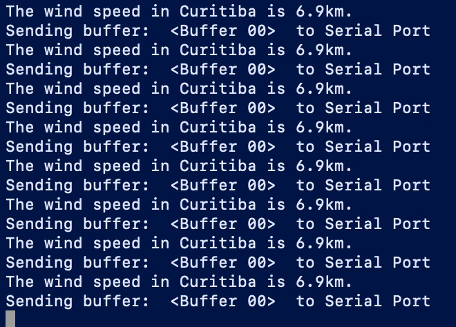

# Weather Systems

_Self-activated wind chime that responds to weather data from anywhere in the world._

Built using a node-linked arduino device - the wind chime moves a simple servo motor depending on the amount of wind of a given location. 

__[Click to hear...](https://vimeo.com/637224646)__

### How it works...
The arduino device (uno) is connected to a serial port via usb on a tiny raspberry pi. The pi is running a node server that continuously makes requests to a weather api. The device is controlled via a simple local website that connects to the pi using web sockets. 

### Attribution
Matt Beall helped me construct the outer casing and suspension platform. 

